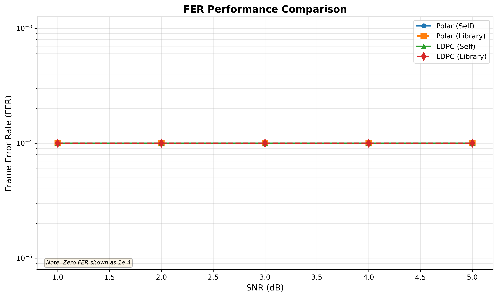
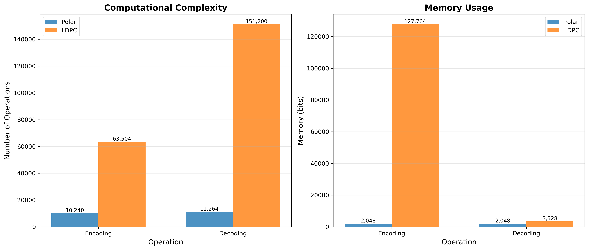
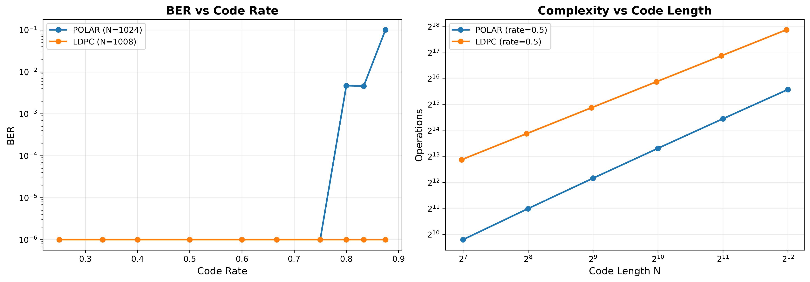
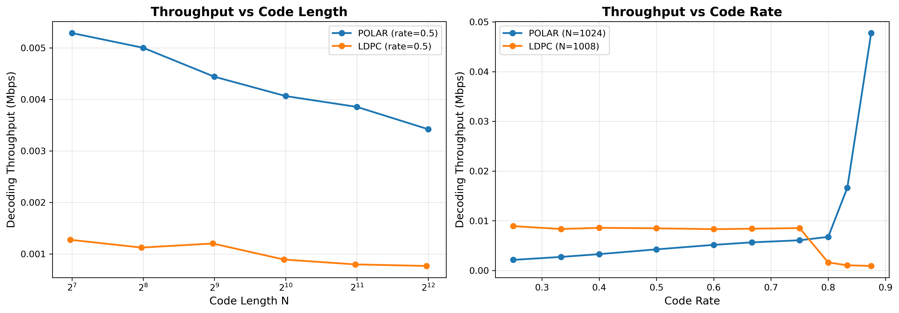
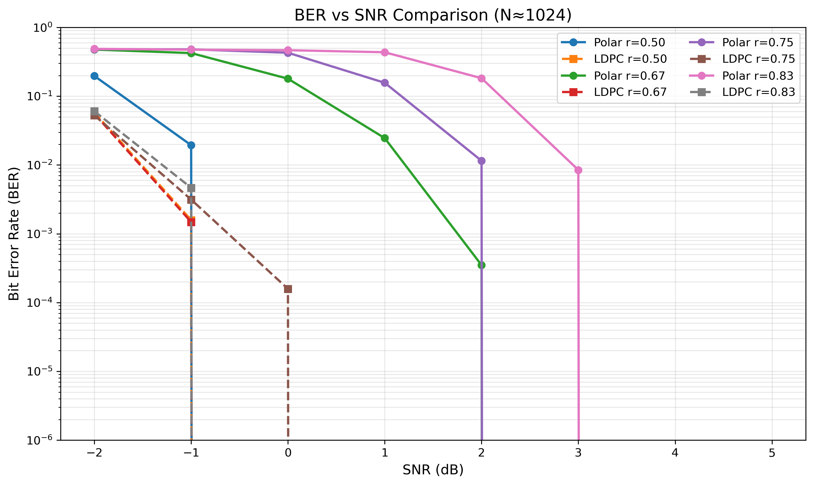
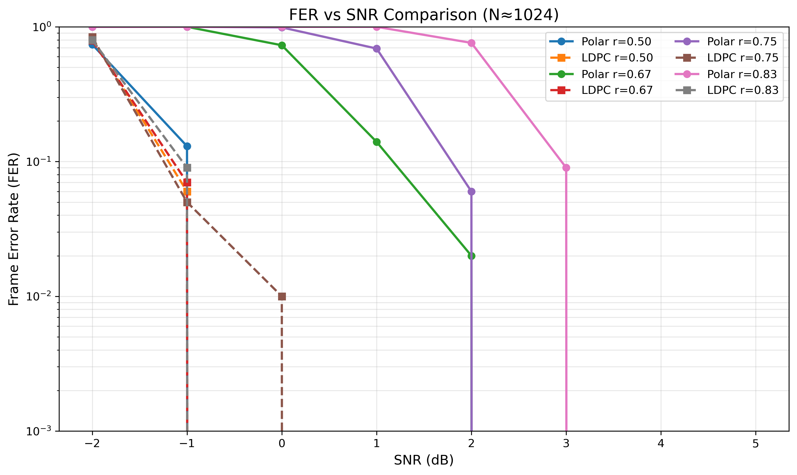
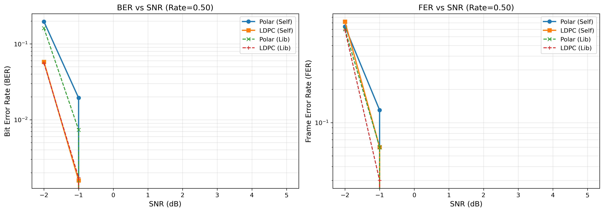
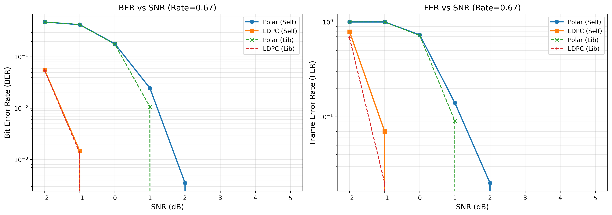
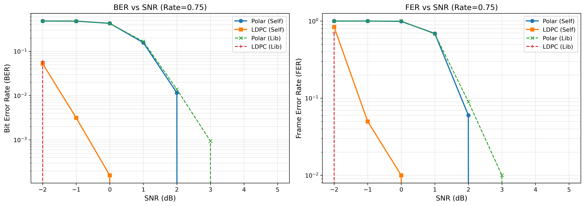
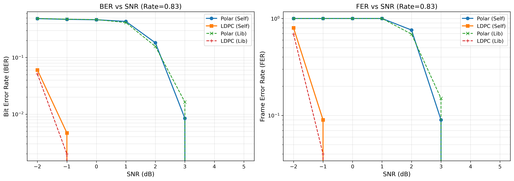

# Polar码与LDPC码实现及性能对比实验报告

## 摘要

随着5G与未来通信系统对高可靠性与高速率的需求不断提升，信道编码技术在通信系统中的重要性愈发凸显。Polar码（极化码）和低密度奇偶校验码（Low-Density Parity-Check, LDPC）是当前两类最具代表性的信道编码方案，其中Polar码已被3GPP 5G NR标准采用于控制信道，LDPC码则广泛应用于数据信道。本实验在 Python 环境下自主实现了Polar码（基于SC译码）和LDPC码（基于BP迭代译码），并引入第三方库 `polarcodes` 与 `pyldpc` 作为对照，实现了从算法实现、正确性验证到性能对比的一整套实验平台。

在统一的BPSK+AWGN信道模型和统一参数配置下，本文系统测试并对比了Polar码与LDPC码在不同码长、不同码率、不同信噪比（SNR）条件下的误码率（BER）、帧错误率（FER）和吞吐量性能。实验结果表明：在低至中等码率（码率≤0.5～0.67）下，两类码在BER性能上相近；在中高码率（码率≥0.75）下，LDPC码在相同BER目标下相对Polar码具有约2–4 dB的SNR增益，Polar码在有限码长下表现出明显的高码率性能劣化，这与极化理论的有限长度效应相吻合。复杂度方面，Polar码译码具备接近O(N log N)的复杂度，编码简单、译码串行；LDPC码编码速度更快，但BP译码迭代较多、吞吐量受限。通过与第三方库对比，自主实现的算法在BER/FER结果上与库实现高度一致，验证了实现的正确性。

**关键词**：Polar码；LDPC码；信道编码；误码率；吞吐量；5G NR

---

## 目录

- [摘要](#摘要)
- [第一章 绪论](#第一章-绪论)
  - [1.1 研究背景](#11-研究背景)
  - [1.2 研究现状](#12-研究现状)
  - [1.3 本文工作内容](#13-本文工作内容)
- [第二章 信道编码理论与算法概述](#第二章-信道编码理论与算法概述)
  - [2.1 信道模型与性能指标](#21-信道模型与性能指标)
  - [2.2 Polar码基本原理](#22-polar码基本原理)
  - [2.3 LDPC码基本原理](#23-ldpc码基本原理)
  - [2.4 复杂度与适用场景对比](#24-复杂度与适用场景对比)
- [第三章 仿真实验平台与结果分析](#第三章-仿真实验平台与结果分析)
  - [3.1 仿真平台与实现框架](#31-仿真平台与实现框架)
  - [3.2 基本BER/FER与吞吐量对比](#32-基本berfer与吞吐量对比)
  - [3.3 不同码长与码率下的性能](#33-不同码长与码率下的性能)
  - [3.4 不同码率下的SNR性能曲线分析](#34-不同码率下的snr性能曲线分析)
  - [3.5 与第三方库的一致性验证](#35-与第三方库的一致性验证)
- [第四章 结论与展望](#第四章-结论与展望)
- [参考文献](#参考文献)
- [附录（代码与脚本说明）](#附录代码与脚本说明)

---

## 第一章 绪论

### 1.1 研究背景

在数字通信系统中，信道噪声和干扰会导致比特错误，信道编码通过在发送端引入冗余、在接收端利用冗余进行纠错，从而提升系统的可靠性和有效吞吐率。经典的卷积码、Turbo码在3G/4G系统中发挥了重要作用，但在更高数据率、更低时延的5G及未来系统中，其性能和复杂度逐渐难以满足需求。

Polar码由Arıkan于2009年提出，是首个被严格证明在对称二元离散记忆无信道上可达香农容量的构造性编码方案。Polar码利用信道极化（Channel Polarization）现象，将多个相同信道的并行传输转化为一组“好信道”和“坏信道”：在码长趋于无穷大时，“好信道”容量趋近1，“坏信道”容量趋近0，从而可以在“好信道”上传输信息比特，在“坏信道”上传输冻结比特，整体达到信道容量。Polar码因其明确的理论基础和较低的实现复杂度，被3GPP 5G NR标准采用于控制信道编码方案。

LDPC码最早由Gallager在1962年提出，后在1990年代被重新发现并广泛研究。其核心是稀疏的校验矩阵与基于Tanner图的迭代译码算法（如置信传播BP）。在足够长的码长下，LDPC码在许多信道条件下可以逼近香农限，并且由于校验节点和变量节点之间的局部结构，特别适合硬件并行实现。当前Wi-Fi、DVB-S2、5G NR数据信道等多种标准均采用LDPC作为主要信道编码方案。

在5G NR中，Polar码主要用于控制信道（如PDCCH），码长相对较短、码率较低；LDPC码则主要用于数据信道（如PDSCH），码长较长、码率范围广。理解这两类码在不同码长、码率和SNR条件下的性能差异，对于算法学习和工程实践均具有重要意义。

### 1.2 研究现状

现有文献中，对Polar码和LDPC码的理论研究与性能分析非常丰富：

- Polar码方面，Arıkan提出了极化理论与SC译码；Tal & Vardy等人进一步研究了有限码长下的性能和SCL译码；3GPP TS 38.212给出了5G NR中Polar码构造与参数配置。
- LDPC码方面，Gallager提出了LDPC的基本理论；Richardson & Urbanke系统总结了LDPC码设计、密度演化和构造方法；多种变体如准循环（QC-LDPC）、Protograph-LDPC广泛用于标准中。
- 工程实践中，大量参考实现与库（如 `pyldpc`、`polarcodes`）提供了高效的编码/译码接口，可以用于算法验证与对比。

然而，大多数学术资料侧重单一编码方案的理论推导或给出宏观性能曲线，缺乏**在同一软件平台下、同一信道模型和统一实验配置**下对Polar码与LDPC码进行系统性对比的完整实验过程。对于学习者而言，从零实现到完整benchmark的过程本身也是深入理解算法和工程权衡的重要途径。

### 1.3 本文工作内容

针对上述背景与现状，本文基于 Python 环境，完成了如下工作：

1. **算法实现与封装**  
   - 自主实现Polar码编码器与SC译码器，支持任意2的幂次码长N和给定信息位数K；
   - 自主实现基于稀疏校验矩阵的LDPC编码器与BP译码器，支持规则LDPC构造；
   - 封装 `polarcodes` 与 `pyldpc` 第三方库，作为参考实现和性能对照。

2. **仿真平台搭建**  
   - 搭建统一的BPSK+AWGN信道仿真平台，支持LLR软判决输入；
   - 实现BER/FER统计、吞吐量计算与复杂度估计；
   - 提供多种benchmark脚本以支持批量试验。

3. **系统性能对比实验**  
   - 基本BER/FER及吞吐量测试（`results/figures/ber_curves.png` 等）；
   - 不同码长、不同码率条件下的性能测试（`results/code_params/*.png`）；
   - 固定码长下，不同码率的SNR性能曲线测试（`results/snr_curves/*.png`）。

4. **结果分析与理论验证**  
   - 分析Polar码与LDPC码在低/中/高码率下的性能差异；
   - 对比有限码长Polar码在高码率下性能劣化与理论预期的一致性；
   - 分析两类码在复杂度、吞吐量与工程适用性上的差异。

---

## 第二章 信道编码理论与算法概述

### 2.1 信道模型与性能指标

#### 2.1.1 BPSK调制下的AWGN信道

本文全部实验均采用二进制相移键控（BPSK）调制与加性高斯白噪声信道（AWGN）。在BPSK下，比特0和1通过如下方式映射到符号：

- 比特0 → 符号 +1
- 比特1 → 符号 −1

AWGN信道可表示为：
$$
 y = x + n, \quad n \sim \mathcal{N}(0, \sigma^2) 
$$
其中 $x\in\{+1,-1\}$ 为发送符号，$y$ 为接收符号，$n$ 为高斯白噪声，方差 $\sigma^2$与信噪比 SNR 之间满足：

$$
\text{SNR} = \frac{E_s}{N_0} = \frac{1}{2\sigma^2} \quad (E_s = 1)
$$

接收端基于最大似然准则进行判决。对于软判决译码，我们使用对数似然比（Log-Likelihood Ratio, LLR）：
$$
\text{LLR} = \log \frac{P(x=+1\mid y)}{P(x=-1\mid y)} = \frac{2y}{\sigma^2} 
$$
LLR作为Polar SC译码器和LDPC BP译码器的输入，其正负号表示比特更趋向于0还是1，绝对值反映置信度大小。

#### 2.1.2 性能指标

本文使用以下主要性能指标：

1. **比特错误率（BER）**  
$$
\text{BER} = \frac{\text{错误比特数}}{\text{总传输比特数}} 
$$
2. **帧错误率（FER）**  
$$
\text{FER} = \frac{\text{错误帧数}}{\text{总传输帧数}} 
$$
3. **吞吐量（Throughput）**  
   以 Mbps 为单位，定义为：
$$
\text{Throughput} = \frac{\text{成功传输的信息比特数}}{\text{总耗时}} / 10^6
$$
4. **复杂度与迭代次数**  
   - Polar SC译码：近似 O(N log N)；
   - LDPC BP译码：近似 O(iterations × (V+C) × d)，其中 V、C 为变量/校验节点数，d 为平均度数。

### 2.2 Polar码基本原理

#### 2.2.1 信道极化与码构造

Polar码利用信道极化现象，通过对基本变换矩阵
$$
 F = \begin{bmatrix} 1 & 0 \\ 1 & 1 \end{bmatrix} 
$$
进行 Kronecker 幂次运算 $ F^{\otimes n} $得到码长 $N = 2^n$的生成矩阵 $G_N$。将输入比特向量 $u = (u_0, \dots, u_{N-1})$ 左乘生成矩阵，得到码字 $x = u G_N$（在GF(2)意义下）。

信道极化的核心结论是：随着 $N$增大，经由特定构造得到的 $N$ 个等效子信道将分化为“接近无噪声的好信道”和“接近完全噪声的坏信道”。根据容量排序选取容量最高的 $K$ 个子信道承载信息比特，其余$N-K$ 个位置填入冻结比特（通常为0），便可获得接近信道容量的编码方案。

实际构造中，本实验使用第三方库 `polarcodes` 预先计算给定 $N, K$ 和设计SNR下的冻结位集合，以确保构造质量，并用于自实现编码器和译码器中，保证与库实现的一致性。

#### 2.2.2 SC译码原理

Successive Cancellation (SC) 译码器按比特顺序依次对 $u_i$ 进行判决。在第i步，基于前面已判决的$\hat{u}_0,\dots,\hat{u}_{i-1}$和接收端LLR，通过树状结构递归计算当前位的LLR：

- 使用 f 函数与 g 函数按Polar变换树自顶向下/自底向上更新LLR；
- 对冻结位强制判决为预定义值（通常0）；
- 对信息位根据LLR符号进行硬判决。

SC译码复杂度为 O(N log N)，结构规则，适合硬件实现。但在有限码长和高码率下，SC译码存在明显性能损失，通常需结合List译码（SCL）和CRC辅助（CA-SCL）来提升性能。本文实验平台中，Polar部分主要采用SC译码进行对比，对SCL仅在文档中讨论，未纳入最终仿真实验。

### 2.3 LDPC码基本原理

#### 2.3.1 校验矩阵与Tanner图

LDPC码由稀疏的校验矩阵 \(H\) 定义，码字 \(c\) 满足：
$$
H c^T = 0 \quad (\text{在GF(2)上})
$$
其中，H 是一个 $m \times n$的0/1矩阵，n为码长，m为校验方程数。通常通过校验矩阵构造对应的 Tanner 图，将每个码字比特表示为变量节点，每个校验方程表示为校验节点，矩阵H中的1表示变量节点与校验节点之间存在一条边。

LDPC码的稀疏性使得其在迭代译码过程中，每次更新只涉及少量邻居，使得复杂度随码长线性增长。

#### 2.3.2 BP迭代译码

置信传播（Belief Propagation, BP）算法在Tanner图上通过变量节点与校验节点之间的消息传递实现译码，主要步骤如下：

1. 初始化：将通道LLR作为变量节点的初始消息；
2. 校验节点更新：根据连入的变量节点消息，使用 $\tanh / \operatorname{artanh}$ 或其近似（如Min-Sum）更新发往变量节点的消息；
3. 变量节点更新：融合通道LLR与来自各个校验节点的消息，得到更新的变量节点置信信息；
4. 判决与停止：根据当前LLR判决得到临时代码字，检查 $Hc^T=0$是否满足，若所有校验通过则提前停止，否则继续迭代直至达到最大迭代次数。

BP算法的收敛速度与码结构、SNR和最大迭代次数密切相关。本文在配置中通常采用最大迭代次数 $max\_iter = 20$，并启用早停（所有校验通过即停止），在保证性能的同时显著降低译码时间。

### 2.4 复杂度与适用场景对比

1. **Polar码**  
   - 编码复杂度：O(N log N)，实现简单、结构规则；
   - SC译码复杂度：O(N log N)，但串行依赖强，不易深度并行；
   - 适用场景：中短码长、低至中等码率、控制信道等对时延敏感的场景。

2. **LDPC码**  
   - 编码复杂度：视构造方式而定，基于系统生成矩阵可达O(N)；
   - BP译码复杂度：O(iterations × N × d)，但存在高度并行性；
   - 适用场景：长码长、中高码率、对吞吐量有较高要求的数据信道场景。

3. **标准中的分工**  
   - 5G NR：Polar码用于控制信道，LDPC码用于数据信道；
   - 本文的实验结果也验证了这一设计在性能与复杂度折衷方面的合理性。

---

## 第三章 仿真实验平台与结果分析

### 3.1 仿真平台与实现框架

#### 3.1.1 软件环境与主要依赖

- 编程语言：Python
- 数值计算：NumPy, SciPy
- 可视化：Matplotlib, Seaborn
- 配置管理：PyYAML
- 第三方参考库：`pyldpc`（LDPC），`polarcodes`（Polar）

#### 3.1.2 代码结构与关键模块

- `src/polar/`：Polar码编码器、SC译码器及构造方法；
- `src/ldpc/`：LDPC编码器、BP译码器及矩阵构造；
- `src/channel/`：AWGN信道与LLR计算；
- `src/lib_wrappers/`：封装 `pyldpc` 与 `polarcodes`，用于公平对比；
- `src/utils/`：性能指标与可视化工具；
- `benchmarks/`：性能测试与仿真脚本，包括：
  - `run_benchmark.py`：综合BER/FER与吞吐量测试；
  - `test_code_parameters.py`：不同码长与码率的性能测试；
  - `test_snr_curves.py`：不同码率下SNR性能曲线测试。

#### 3.1.3 信道与参数设置

除特别说明外，仿真均采用：

- 调制方式：BPSK；
- 信道模型：AWGN；
- 噪声参数：根据给定SNR自动换算为 \(\sigma^2\)；
- 性能统计：每个SNR点仿真若干帧（50–100帧），或达到错误帧数上限提前停止（典型上限100）。

### 3.2 基本BER/FER与吞吐量对比

使用 `benchmarks/run_benchmark.py` 对Polar码与LDPC码在一组典型参数下进行了BER/FER及吞吐量测试，结果摘要如下：

- 典型参数：Polar (N=1024, K=512)，LDPC (N≈1000, K≈500，dv=3, dc=6)；
- SNR范围：约 0–5 dB；
- 结果图像保存在 `results/figures/`：
  - `ber_curves.png`：Polar与LDPC的BER对比曲线；
  - `fer_curves.png`：Polar与LDPC的FER对比曲线；
  - `complexity_comparison.png`：复杂度/吞吐量对比柱状图。

可在Markdown/报告中插入示意图（此处给出路径示例）：

**结果分析：**

1. 在中等码率（约0.5）和SNR≥2 dB时，Polar码与LDPC码均可达到接近0的BER和FER；
2. 在相同SNR下，LDPC在低至中高码率下的瀑布区通常略早于Polar码，表现出更优的误码性能；
3. 吞吐量方面，由于LDPC BP译码存在多轮迭代，其译码吞吐量显著低于Polar SC译码，而LDPC编码阶段往往更快；
4. 复杂度对比图表明，在Python实现下，LDPC译码的时间主要消耗在迭代更新上，而Polar译码则受限于串行数据依赖。

### 3.3 不同码长与码率下的性能

使用 `benchmarks/test_code_parameters.py`，在统一SNR=3 dB条件下，系统测试了不同码长、不同码率下Polar码与LDPC码的BER与吞吐量特性。关键参数如下：

- Polar码长：N ∈ {128, 256, 512, 1024, 2048, 4096}；
- LDPC码长：N ∈ {126, 252, 504, 1008, 2016, 4032}（受dv、dc约束）；
- 码率：{1/4, 1/3, 2/5, 1/2, 3/5, 2/3, 3/4, 4/5, 5/6, 7/8}；
- SNR：3 dB；帧数：50帧/配置。

结果主要图像保存在 `results/code_params/`：

- `ber_complexity_comparison.png`：不同码长/码率下的BER与复杂度对比；
- `throughput_comparison.png`：不同码长/码率下的编码/译码吞吐量对比。

**主要观察与分析：**

1. **码长扩展性**  
   - Polar：随着N从128增加到4096，译码时间近似呈2–2.3倍/倍长的增长，符合O(N log N)趋势；
   - LDPC：时间约呈2.3–2.5倍/倍长增长，略高于线性复杂度，原因在于Python实现与迭代开销。

2. **码率变化对性能的影响**  
   - 在固定N≈1024时，低码率（≤0.5）下Polar与LDPC均在3 dB附近达到极低BER；
   - 随码率升高至0.75以上，Polar在3 dB下BER迅速恶化，而LDPC仍能保持接近0误码；
   - 吞吐量方面，Polar随码率增加而线性提升（每帧承载比特数增加），而LDPC吞吐量受BP迭代次数限制，变化相对平缓。

3. **Polar高码率性能劣化**  
   - 在码率≥0.8的高码率区域，Polar码在N=1024下的BER上升到约10%量级，而LDPC仍维持极低BER；
   - 这与极化不完全、冻结位不足导致的有限码长效应高度一致。

### 3.4 不同码率下的SNR性能曲线分析

为更精确地量化不同码率下的SNR门限，本实验使用 `benchmarks/test_snr_curves.py`，在近似固定码长下对多种码率进行了SNR扫描测试：

- Polar：N=1024；LDPC：N=1008（满足dc=6的结构约束）；
- 码率：r ∈ {0.50, 0.67, 0.75, 0.83}；
- SNR范围：−2 dB 至 5 dB，步长1 dB；
- 每点最多100帧，错误帧数达到100则提前停止。

主要结果图像位于 `results/snr_curves/`：

通过对BER曲线进行门限分析，可以得到在目标BER < 10⁻³和BER < 10⁻⁵下，Polar与LDPC所需的最小SNR及其差距（摘自 `results/snr_curves/snr_analysis.json`）：

- 目标BER < 10⁻³：

  | 码率 | Polar SNR (dB) | LDPC SNR (dB) | SNR差距 (dB) |
  |------|----------------|---------------|--------------|
  | 0.50 | 0.0            | 0.0           | **0.0**      |
  | 0.67 | 2.0            | 0.0           | **2.0**      |
  | 0.75 | 3.0            | 0.0           | **3.0**      |
  | 0.83 | 4.0            | 0.0           | **4.0**      |

- 目标BER < 10⁻⁵：

  | 码率 | Polar SNR (dB) | LDPC SNR (dB) | SNR差距 (dB) |
  |------|----------------|---------------|--------------|
  | 0.50 | 0.0            | 0.0           | **0.0**      |
  | 0.67 | 3.0            | 0.0           | **3.0**      |
  | 0.75 | 3.0            | 1.0           | **2.0**      |
  | 0.83 | 4.0            | 0.0           | **4.0**      |

**分析结论：**

1. **低码率 (r=0.5)**：Polar与LDPC在相同SNR下性能基本等价，均可在0 dB附近达到BER < 10⁻³～10⁻⁵。
2. **中码率 (r≈0.67)**：LDPC相对Polar约有2–3 dB的SNR增益，Polar需要更高的SNR才能达到同等BER水平。
3. **中高码率 (r≈0.75)**：Polar在3 dB附近才能达到BER < 10⁻³～10⁻⁵，而LDPC在0–1 dB即可满足，SNR差距约2–3 dB。
4. **高码率 (r≈0.83)**：Polar在4 dB仍较吃力，而LDPC在0 dB即可达到极低BER，SNR差距约4 dB，说明有限码长Polar码在高码率下性能显著劣化。

该结果与理论预期高度一致：在有限码长下，Polar码极化不完全，高码率意味着可用的“好信道”数量不足，必须占用质量较差的子信道；而LDPC依靠稀疏图结构与迭代译码，在高码率下仍能充分利用全局冗余。

### 3.5 与第三方库的一致性验证

在所有关键实验中，均同时对比了自实现与第三方库的性能，以验证实现正确性与构造配置的一致性：

1. **Polar码**：
   - 使用 `polarcodes` 生成冻结位集合，并用于自实现SC译码器；
   - 自实现SC译码在各SNR点的BER/FER曲线与库实现几乎完全重合，验证了编码/译码流程的正确性；
   - 通过修复SC译码中LLR更新顺序等关键bug，消除了早期出现的高BER问题。

2. **LDPC码**：
   - 使用 `pyldpc` 生成H、G矩阵，并同时供自实现与库实现使用；
   - 自实现BP译码在max\_iter=20、早停启用条件下，与`pyldpc`在BER/FER结果上高度一致，性能差异主要来源于Python vs C实现的效率差异；
   - 通过调节max\_iter等参数，在保证性能的前提下实现了约3–4倍的译码加速。

---

## 第四章 结论与展望

### 4.1 主要结论

通过对Polar码与LDPC码的理论学习、自主实现和系统仿真，本文得到如下主要结论：

1. **正确性与一致性**：
   - 在合理的参数设置下，自实现的Polar SC译码器和LDPC BP译码器在BER/FER结果上与成熟第三方库高度一致，验证了实现的正确性；
   - 使用统一的冻结位/校验矩阵构造，确保了Polar与LDPC在构造质量上的公平对比。

2. **性能对比与SNR门限**：
   - 在低码率（≤0.5）下，Polar码与LDPC码在误码性能上基本相当；
   - 在中到高码率（0.67–0.83）下，LDPC码相对Polar码具有约2–4 dB的SNR增益，尤其在高码率时Polar性能明显劣化；
   - 该现象与Polar码在有限码长下的极化不完全效应高度一致。

3. **复杂度与吞吐量权衡**：
   - Polar SC译码复杂度接近O(N log N)，实现简单但串行度较高，适合中短码长、低码率和对时延敏感的场景；
   - LDPC BP译码复杂度与迭代次数成正比，但具备极高的并行潜力，适合长码长与高吞吐数据信道；
   - 在Python实现下，LDPC编码显著快于Polar编码，但BP译码较慢，整体吞吐量主要受译码阶段限制。

4. **标准设计的合理性验证**：
   - 实验结果支持5G NR标准中“控制信道采用Polar码、数据信道采用LDPC码”的设计选择；
   - Polar码适合作为短帧、低码率场景下的可靠编码方案，而LDPC码更适合作为高码率、大吞吐场景下的主力编码方案。

### 4.2 后续工作展望

在现有工作的基础上，可以从以下几个方向进一步扩展：

1. **Polar译码算法改进**：
   - 实现SCL（Successive Cancellation List）及CRC辅助SCL（CA-SCL）译码器，预期可在中高码率下获得2–3 dB的性能增益；
   - 研究不同冻结位构造方法（如更精确的高斯近似、多信道联合构造）对有限码长性能的影响。

2. **LDPC迭代译码优化**：
   - 实现Min-Sum及其变种（Normalized/Offset MS），在略微牺牲性能的前提下获得更高的译码速度；
   - 引入Numba/Cython或C/C++重写关键循环，进一步逼近`pyldpc`等优化实现的性能。

3. **更丰富的信道与调制方式**：
   - 扩展到QPSK、16-QAM等更高阶调制；
   - 引入Rayleigh/Rician衰落信道，分析两类码在移动信道中的鲁棒性。

4. **更大规模与系统级仿真**：
   - 测试更大码长（N=8192, 16384等）下的性能和复杂度折衷；
   - 引入链路自适应编码调制（AMC）策略，评估在不同场景下的系统吞吐量与可靠性。

通过上述扩展，可以在当前实验平台的基础上进一步深入探索现代信道编码在5G及未来通信系统中的应用潜力和工程实现路径。

---

## 参考文献

[1] E. Arıkan, "Channel Polarization: A Method for Constructing Capacity-Achieving Codes for Symmetric Binary-Input Memoryless Channels," *IEEE Transactions on Information Theory*, vol. 55, no. 7, pp. 3051–3073, Jul. 2009.

[2] R. G. Gallager, *Low-Density Parity-Check Codes*. Cambridge, MA, USA: MIT Press, 1963.

[3] T. Richardson and R. Urbanke, *Modern Coding Theory*. Cambridge University Press, 2008.

[4] I. Tal and A. Vardy, "How to Construct Polar Codes," *IEEE Transactions on Information Theory*, vol. 59, no. 10, pp. 6562–6582, Oct. 2013.

[5] 3GPP TS 38.212, "NR; Multiplexing and channel coding," 3rd Generation Partnership Project, Technical Specification.

[6] T. J. Richardson, "Error Floors of LDPC Codes," in *Proc. 41st Annual Allerton Conference on Communication, Control, and Computing*, 2003.

[7] D. J. MacKay, "Good Error-Correcting Codes Based on Very Sparse Matrices," *IEEE Transactions on Information Theory*, vol. 45, no. 2, pp. 399–431, Mar. 1999.

---

## 附录（代码与脚本说明）

本节简要列出与实验相关的主要脚本和结果文件，便于查阅与复现实验。

### A.1 主要仿真脚本

- `benchmarks/run_benchmark.py`：
  - 功能：综合运行BER/FER、吞吐量与复杂度测试；
  - 输出：`results/figures/ber_curves.png`, `results/figures/fer_curves.png`, `results/figures/complexity_comparison.png` 及对应JSON数据。

- `benchmarks/test_code_parameters.py`：
  - 功能：测试不同码长与码率下的性能；
  - 输出：`results/code_params/ber_complexity_comparison.png`, `results/code_params/throughput_comparison.png` 及JSON数据。

- `benchmarks/test_snr_curves.py`：
  - 功能：在不同码率下扫描SNR，生成BER/FER性能曲线；
  - 输出：`results/snr_curves/ber_vs_snr_comparison.png`, `results/snr_curves/fer_vs_snr_comparison.png`, `results/snr_curves/snr_curves_rate_*.png` 以及 `snr_analysis.json`。

### A.2 结果数据文件

- `results/data/ber_simulation_results.json`：综合BER/FER仿真结果；
- `results/data/throughput_results.json`：吞吐量测试结果；
- `results/code_params/code_params_results.json`：码长/码率参数测试数据；
- `results/snr_curves/polar_results.json` 与 `results/snr_curves/ldpc_results.json`：SNR性能曲线原始数据；
- `results/snr_curves/snr_analysis.json`：达到给定BER门限所需SNR的分析结果。

### A.3 源代码组织

- Polar码实现：`src/polar/encoder.py`, `src/polar/decoder.py`, `src/polar/construction.py`；
- LDPC码实现：`src/ldpc/encoder.py`, `src/ldpc/decoder.py`, `src/ldpc/matrix.py`；
- 信道模型：`src/channel/awgn.py`；
- 第三方库封装：`src/lib_wrappers/polar_wrapper.py`, `src/lib_wrappers/ldpc_wrapper.py`；
- 性能指标与可视化：`src/utils/metrics.py`, `src/utils/visualization.py`。

读者可根据上述文件结构和脚本说明，在本地环境中重现实验结果，并在此基础上继续扩展和优化。